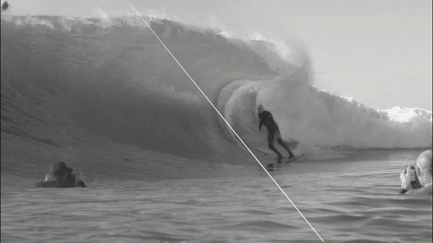

# 2020-ACM-MM-Supplementary
## Ternary Denoising Masks Synthesis Network for Learning Blind Video Temporal Consistency

### Comparsions with Pre-processed Video
- WCT Sketch and WCT Antimonocromatismo

  
    
  

- CycleGAN Photo-to-Vangogh and Colorization

  
  

- HDRToning and DBL ExpertsA

  
  

### Comparsions with Bonneel et al. 
- WCT Wave and WCT Candy

  
    
  

- Fast-neural-style Princess and CycleGAN Photo-to-Ukiyoe

  
  

- Fast-neural-style Udnie and Colorization

  
  

### Comparsions with Lai et al. 
- Fast-neural-style Udnie and HDRToning

  
    
  

- HDRToning and WCT Feathers

  
  

- Intrinsic Shading and WCT Wave

  
  

